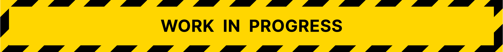

	

 
 

  # 📝 Todoos ✅

  A simple todo app to manage your tasks!. Made with Next.js, Firebase, Tailwind CSS and TypeScript.

  <a href="https://todoos.vercel.app">View Demo</a>
  ·
  <a href="https://github.com/cosmoart/todoos/issues">Report Bug</a>
  ·
  <a href="https://github.com/cosmoart/todoos/issues">Request Feature</a>

<!-- TABLE OF CONTENTS -->

Table of contents

- [About The Project](#about-the-project)
- [Screenshots](#screenshots)
- [Built With](#built-with)
- [License](#license)
- [Acknowledgments](#acknowledgments)
- [Contact](#contact)

<!-- ABOUT THE PROJECT -->
## About The Project

This application is a demo to practice my skills using Next.js and Tailwind CSS. It includes features such as dark mode, todos storage and authentication, and is built with a responsive design that adapts to different screen sizes. The code is written in TypeScript and Firebase is used for authentication and database. I made this project following a [course](https://www.youtube.com/playlist?list=PLV8x_i1fqBw1VR86y4C72xMGJ8ifjBwJ6) by [Midudev](https://www.youtube.com/@midudev).

(<a href="#top">back to top</a>)

<!-- SCREENSHOTS -->
## Screenshots

<table>
    <tr>
      <td>
          
      </td>
      <td>
          
      </td>
      <td>
          
      </td>
    </tr>
</table>

(<a href="#top">back to top</a>)

### Built With

* [Next.js](https://nextjs.org/)
* [React.js](https://reactjs.org/)
* [Firebase](https://firebase.google.com/) - Authentication and database
* [Tailwind CSS](https://tailwindcss.com/) - CSS framework
* [Vercel](https://vercel.com/) - Deployment and hosting
* [TypeScript](https://www.typescriptlang.org/)

(<a href="#top">back to top</a>)

<!-- LICENSE -->
## License

Distributed under the **MIT License**. See [`LICENSE`](https://github.com/cosmoart/todoos/blob/main/LICENSE) for more information.

(<a href="#top">back to top</a>)

<!-- KNOWGLEDGEMENTS -->

## Acknowledgments

* [Curso gratuito de Next.js y Firebase](https://www.youtube.com/playlist?list=PLV8x_i1fqBw1VR86y4C72xMGJ8ifjBwJ6) by [Midudev](https://www.youtube.com/@midudev)

<!-- CONTACT -->
## Contact

* My website - [https://cosmoart.vercel.app](https://cosmoart.vercel.app)
* Twitter - [@CosmoArt0](https://twitter.com/cosmoart0)

(<a href="#top">back to top</a>)

